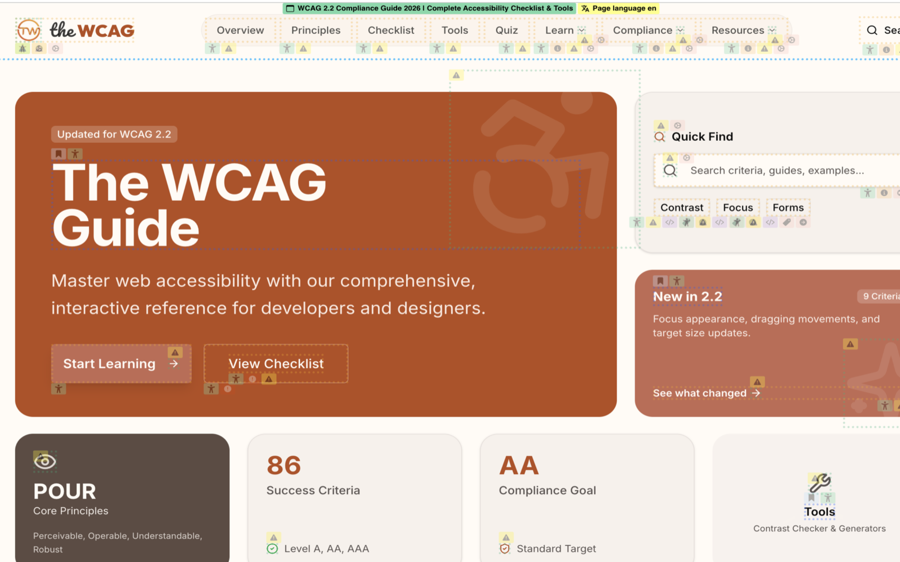

# TheWCAG Accessibility Visualizer Browser Extension



*Screenshot from [thewcag.com](https://thewcag.com)*

## About

**TheWCAG Accessibility Visualizer** is a browser extension that visualizes important but visually invisible accessibility information on web pages to help developers improve web accessibility.

This project is built on top of the original [Accessibility Visualizer](https://github.com/ymrl/a11y-visualizer) by [ymrl](https://github.com/ymrl), which provided the foundation and core functionality. We've extended and enhanced it with additional features, improvements, and rebranded it as **TheWCAG Accessibility Visualizer** to better reflect our focus on WCAG compliance and accessibility standards.

### What We Built On Top Of

- **Original Project**: [Accessibility Visualizer](https://github.com/ymrl/a11y-visualizer) by [ymrl](https://github.com/ymrl)
- **Original License**: MIT License
- **Our Contributions**: 
  - Enhanced branding and naming to reflect WCAG focus
  - Improved website design and user experience
  - Additional features and accessibility improvements
  - Comprehensive documentation updates

We are grateful to the original author for creating this excellent foundation and making it available under the MIT License.

## Install

- [Chrome Web Store](https://chromewebstore.google.com/detail/accessibility-visualizer/idcacekakoknnpbfjcdhnkffgfbddnhk)
- [Firefox Add-ons](https://addons.mozilla.org/ja/firefox/addon/accessibility-visualizer/)

## Users' Guide

- [TheWCAG Accessibility Visualizer ユーザーズガイド (Japanese)](./docs/ja/UsersGuide.md)
- [TheWCAG Accessibility Visualizer User's Guide (English)](./docs/en/UsersGuide.md)
- [TheWCAG Accessibility Visualizer 사용자 가이드 (Korean)](./docs/ko/UsersGuide.md)

## How to develop

It is built with [WXT](https://wxt.dev/).

To develop extension, launch the dev server

```
# Install dependencies
$ pnpm install

# To develop for Chrome/Chromium browsers
$ pnpm --filter=@a11y-visualizer/browser-extension dev

# To develop for Firefox
$ pnpm --filter=@a11y-visualizer/browser-extension dev:firefox
```

WXT will automatically open your browser and load the extension in development mode.

You can test the extension using the test pages available on the website at `/tests`. The website serves as both promotional content and comprehensive test cases for accessibility features.

## Website Deployment

The website is automatically deployed to GitHub Pages when changes are pushed to the `main` branch. See [apps/website/DEPLOYMENT.md](./apps/website/DEPLOYMENT.md) for detailed deployment instructions.

To build the website locally:

```bash
# Build the website
$ pnpm --filter=@a11y-visualizer/website build

# Preview the built website
$ pnpm --filter=@a11y-visualizer/website preview
```

## How to build

```
# Install dependencies
$ pnpm install

# Build browser extension for Chrome/Chromium
$ pnpm --filter=@a11y-visualizer/browser-extension build

# Build browser extension for Firefox
$ pnpm --filter=@a11y-visualizer/browser-extension build:firefox

# Create zip files for store distribution
$ pnpm zip                                    # Creates Chrome zip (from root)
$ pnpm --filter=@a11y-visualizer/browser-extension zip      # Chrome zip
$ pnpm --filter=@a11y-visualizer/browser-extension zip:firefox  # Firefox zip
```

The built extensions will be in `apps/browser_extension/dist/` directory, and zip files will be created in the same location.

**Chrome Web Store Zip**: `apps/browser_extension/dist/thewcag-a11y-visualizer-{version}-chrome.zip`

For detailed publishing instructions, see [CHROME_STORE_PUBLISHING.md](./CHROME_STORE_PUBLISHING.md).

## Privacy Policy

[./PRIVACY.md](./PRIVACY.md)

## Credits and Attribution

This project is built on top of the original [Accessibility Visualizer](https://github.com/ymrl/a11y-visualizer) by [ymrl](https://github.com/ymrl). We extend our sincere gratitude to the original author for creating this excellent foundation and making it available under the MIT License.

### Original Project
- **Repository**: [ymrl/a11y-visualizer](https://github.com/ymrl/a11y-visualizer)
- **Author**: [ymrl](https://github.com/ymrl)
- **License**: MIT License

### This Project
- **Repository**: [thewcag-accessibility-visualizer](https://github.com/YOUR_USERNAME/thewcag-accessibility-visualizer)
- **Based on**: Accessibility Visualizer by ymrl
- **License**: MIT License ([./LICENSE.txt](./LICENSE.txt))

## License

MIT License ([./LICENSE.txt](./LICENSE.txt))
